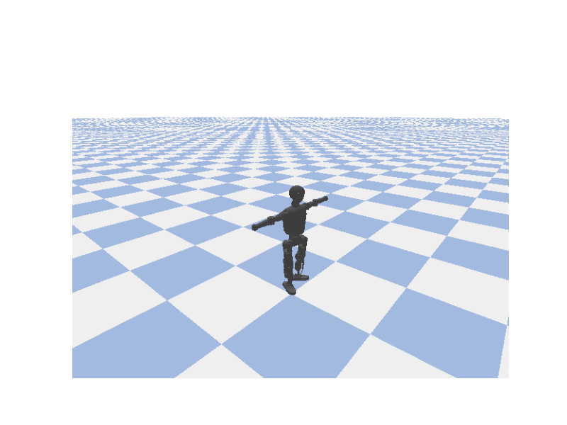
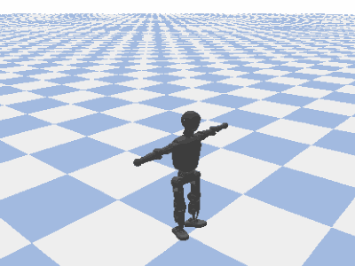

# T1 Bipedal Locomotion with Reinforcement Learning

**Drew Burcher · Dan Torri · Nathan Wyatt**  
Virginia Tech — CS 4824 / ECE 4424 Machine Learning, Spring 2026

Train a 13-DoF bipedal humanoid (Booster Robotics T1) to walk forward in PyBullet using **PPO** and **SAC** via a custom Gymnasium environment.

| PPO best attempt | SAC final gait |
|-----------------|----------------|
|  |  |

---

## Overview

The T1 robot is simulated in PyBullet at 240 Hz. A policy runs at 60 Hz and outputs normalized joint position targets for 13 joints (waist + both legs). Arms are locked at zero.

**Observation (36-dim):** torso height, orientation (Euler), linear/angular velocity, 13 joint positions, 13 joint velocities.

**Action (13-dim, `[-1, 1]`):** normalized targets mapped to each joint's URDF range.

**Reward:**
```
r = 3.0 · v_x                        # forward velocity
  + 2.0                               # alive bonus
  − 0.00495 · mean|τ · q̇|            # energy penalty
  − 0.5 · (roll² + pitch²)           # orientation
  − 0.2 · Σ max(|q_i| − 0.5, 0)²    # joint limit
  − 0.5 · max(−ż, 0)                 # anti-drop
  − 100  on fall                      # terminal penalty
```

Both algorithms use a `[256, 256]` MLP, γ=0.99, Adam at 3×10⁻⁴. Training runs on CPU (faster than GPU for small MLPs + PyBullet).

---

## Results

| | PPO | SAC |
|---|---|---|
| Steps trained | ~1.4 M | ~2.8 M |
| Best eval return | ~3,000 | ~7,100 |
| Forward speed | ~0.07 m/s | ~1.6 m/s |
| Throughput | ~300 steps/s | ~50 steps/s |

SAC learns to stand (~300k steps), then transitions to a clear walking phase (1–2 M steps), reaching ~1.6 m/s and ~26 m per 16.7 s episode. PPO produced early stepping behavior but never achieved a sustained gait within the project timeline.

---

## Repository Structure

```
.
├── main.py            # Unified CLI entry point
├── env.py             # T1Walking-v0 Gymnasium environment
├── robot.py           # T1 URDF loader and state interface
├── train.py           # Training script with callbacks and dashboard
├── evaluate.py        # Evaluation and algorithm comparison
├── visualize.py       # Training curve plots
├── ablation.py        # Reward component ablation study
├── live_plot.py       # Real-time training dashboard
├── config.py          # All hyperparameters and reward weights
├── requirements.txt
├── T1/                # Robot URDF and mesh files
└── docs/              # Project website, paper, slides, figures
```

---

## Setup

Python 3.9–3.11 recommended.

```bash
pip install -r requirements.txt
```

Dependencies: `pybullet`, `stable-baselines3`, `gymnasium`, `torch`, `matplotlib`, `tensorboard`.

---

## Usage

All commands go through `main.py`.

### Demo (random actions, no training)
```bash
python main.py demo
```
Opens the PyBullet GUI with random actions — useful to verify the environment loads.

### Train
```bash
# PPO, 2M timesteps (default)
python main.py train --algo ppo

# SAC with custom run name and length
python main.py train --algo sac --timesteps 1000000 --name my_run

# Disable live dashboard (useful on headless machines)
python main.py train --algo ppo --no-plot
```

Each run is saved to `runs/<run_name>/` with model weights, normalization stats, TensorBoard logs, and evaluation checkpoints.

### Resume a paused run
```bash
python main.py train --algo sac --resume runs/my_run --timesteps 1000000
```
SAC also restores its replay buffer for seamless continuation.

### Evaluate
```bash
# Headless, 10 episodes
python main.py eval --run runs/my_run --algo sac

# With live visualization
python main.py eval --run runs/my_run --algo sac --render --episodes 20
```

### Compare PPO vs SAC
```bash
python main.py compare --runs runs/ppo_run runs/sac_run --algos ppo sac
```

### Plot training curves
```bash
python main.py plot --run runs/my_run --algo sac
```

### Record video
```bash
python main.py record --run runs/my_run --algo sac
```
Saves `.mp4` (or `.gif` if ffmpeg is unavailable).

### Reward ablation study
```bash
python main.py ablation --algo ppo --timesteps 500000
```
Trains 6 variants (baseline + one per reward component removed) and produces bar charts.

---

## Configuration

All tunable parameters are in `config.py`:
- `ENV_CONFIG` — simulation frequency, episode length, fall threshold
- `REWARD_WEIGHTS` — per-component reward weights
- `PPO_CONFIG` / `SAC_CONFIG` — algorithm hyperparameters
- `ACTUATED_JOINT_INDICES` — which joints the policy controls

---

## AI Assistance

Claude (Anthropic) assisted with parts of the implementation.
